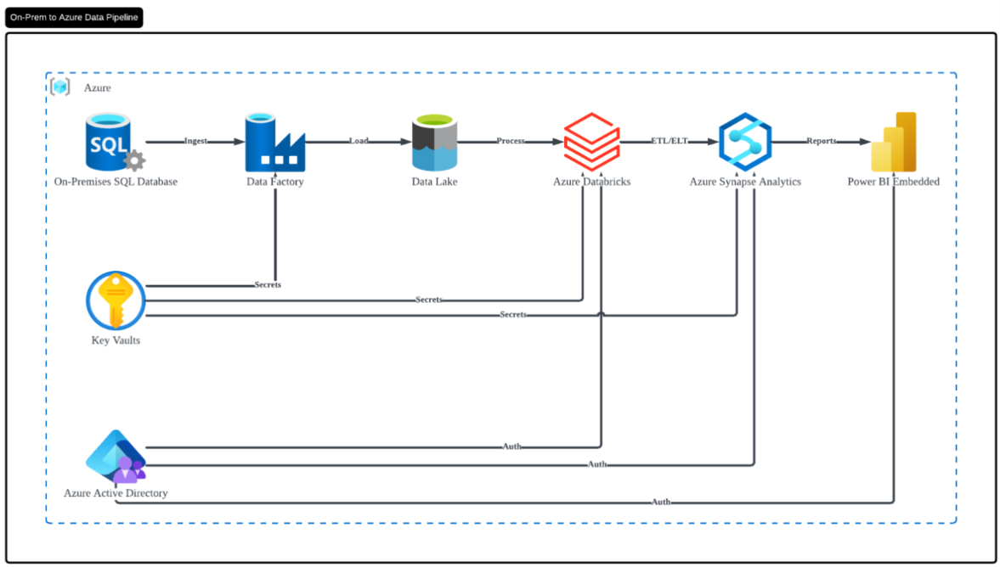
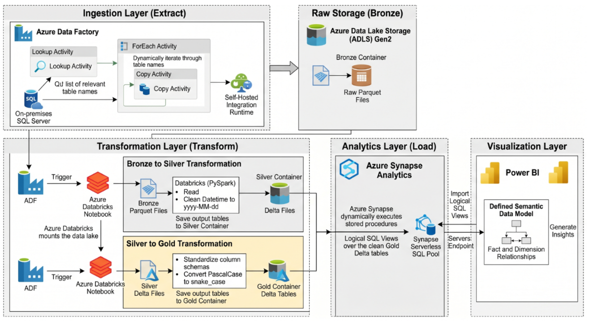
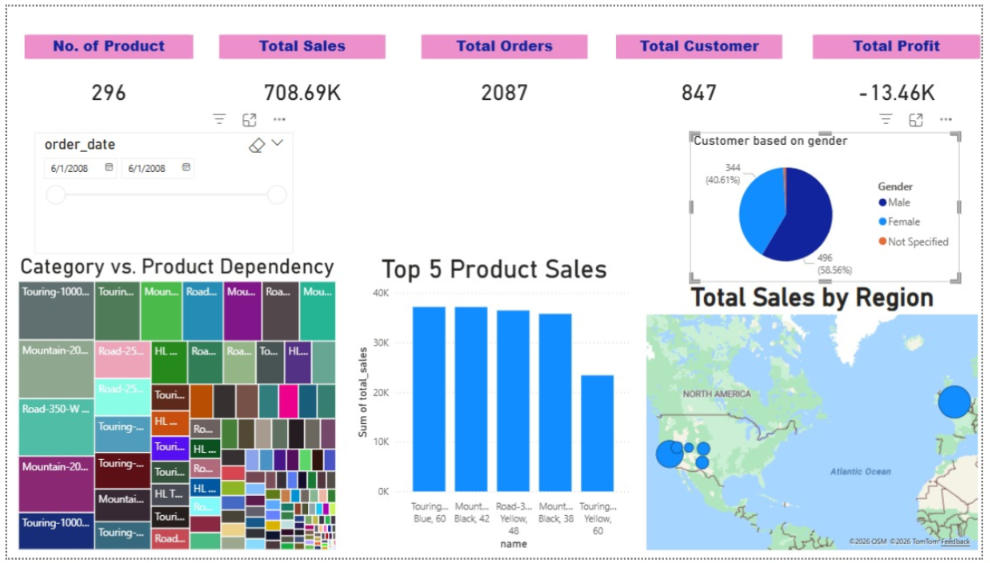

## 1. Project Summary
In this tutorial, I built a comprehensive end-to-end data pipeline on Microsoft Azure to address a critical business objective: analyzing customer demographics (specifically gender distribution) and understanding how it influences product purchases. 

The solution extracts customer and sales data from an on-premises Microsoft SQL Server (simulating the `AdventureWorksLT2025` database) and processes it in the cloud to generate actionable insights. To ensure efficiency and structural integrity, the pipeline implements a **Medallion Architecture** using Azure Data Lake Storage Gen2:
*   **Bronze Layer (Extract):** Azure Data Factory (ADF) ingests raw, unmodified Parquet data from the on-premise database.
*   **Silver Layer (Transform):** Azure Databricks cleanses the data using PySpark, standardizing messy timestamps into `yyyy-MM-dd` formats, and stores it as optimized Delta files. 
*   **Gold Layer (Load):** Databricks performs final structural formatting (converting `PascalCase` to `snake_case`), and Azure Synapse Analytics creates logical SQL views for seamless reporting.

The final output is an interactive Microsoft Power BI dashboard that highlights Key Performance Indicators (KPIs) such as total sales, product performance, geographical distribution, and interactive timeline filtering. Security was maintained throughout by using Azure Key Vault to store sensitive credentials instead of hardcoding them.

---

## 2. Evidence of the Tutorial

**Architecture Overview:**

*Figure 1: Illustration of the proposed Azure-based data engineering Medallion pipeline.* [4, 8]

**Data Pipeline Architecture:**

*Figure 2: Data pipeline architecture.*

**Business Insights (Power BI Dashboard):**

*Figure 3: The final interactive Power BI dashboard displaying demographic insights, product performance, and KPIs.*

---

## 3. Reflection

### What I Have Learnt
* I learned how to systematically transition data from raw (Bronze) to cleansed (Silver) to business-ready (Gold) using scalable cloud resources.
* Connecting a cloud-based service to a local, on-premises SQL server required downloading and configuring a Self-Hosted Integration Runtime (SHIR) to act as a secure bridge. I also tackled "Login failed" connectivity errors caused by dynamic IP addresses on the UTM Wi-Fi by actively configuring server-level firewall rules to allow Azure services to bypass the gateway.
* I developed a strong understanding of cloud governance by using Managed Identities and Azure Key Vault to securely manage database passwords. Furthermore, I successfully navigated restrictions related to credential transmission in Databricks multi-node trial clusters by adapting the environment to a single-node cluster.
d guarantee that no null or corrupted values make it to the Power BI dashboard.
3. We could configure the Databricks clusters to automatically terminate after a shorter period of inactivity, and trigger the ADF pipelines strictly on a schedule rather than manually, to simulate a more cost-effective production environment.
