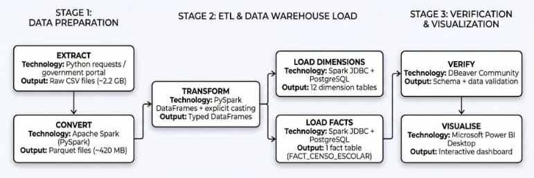
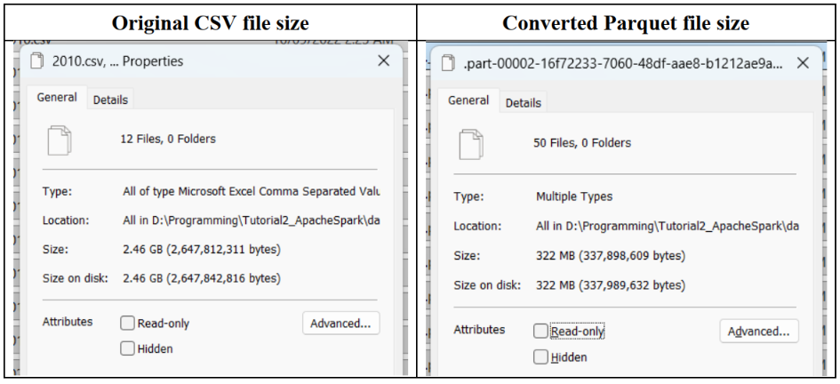
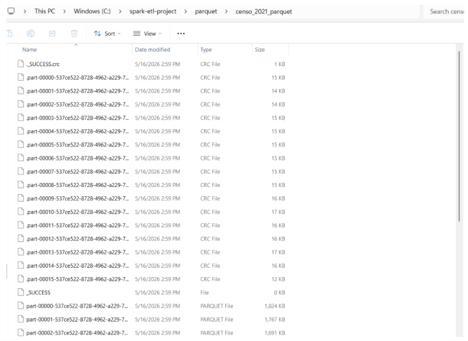
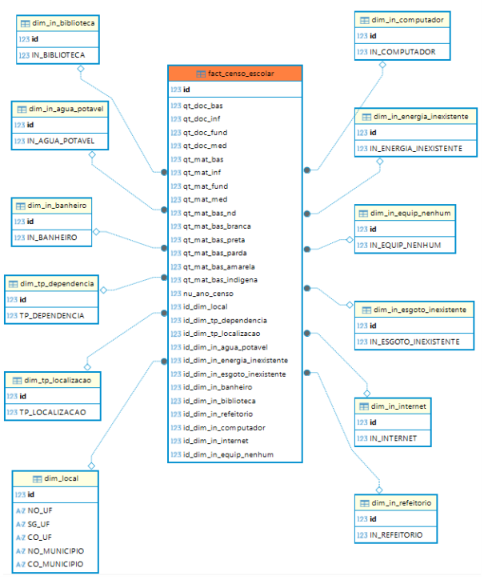
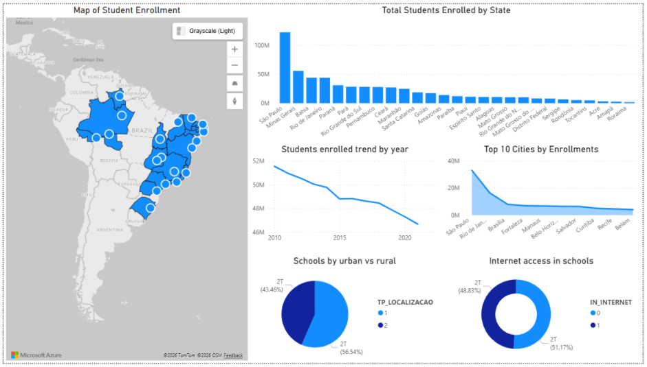

# Tutorial 2: Apache Spark (ETL Pipeline & Data Warehousing)

## 1. Project Summary
In this tutorial, I developed a complete Extract, Transform, and Load (ETL) data pipeline using Apache Spark to process large-scale educational data. The project utilized the Brazilian school census dataset (2010–2021), comprising approximately 2.2 GB of raw CSV data. Guided by the CRISP-DM methodology, the objective was to clean, transform, and load this vast dataset into a structured data warehouse for analysis.

The pipeline workflow was executed locally on a Windows 11 environment and consisted of the following stages:
*   **Extract:** Raw CSV files were downloaded from the Brazilian Ministry of Education portal.
*   **Transform:** Apache Spark (via PySpark) was utilized to clean the data, remove duplicates, explicitly cast data types, and convert the massive CSVs into the highly optimized Parquet format, reducing the data size from 2.2 GB to roughly 420 MB.
*   **Load:** I designed a multidimensional **Star Schema** data warehouse featuring 12 dimension tables and 1 central fact table (`FACT_CENSO_ESCOLAR`). The processed data was loaded into a PostgreSQL database running inside a Docker container using a JDBC driver.
*   **Visualize:** Microsoft Power BI was connected to the PostgreSQL warehouse to build an interactive dashboard showcasing student enrolment trends, geographical distributions, and school infrastructure metrics.

---

## 2. Tutorial Deliverables

**ETL Architecture & Data Flow:**

*Figure 1: The architecture of the ETL pipeline detailing the Extract, Transform, Load, and Visualise stages.*

**Comparison of Original File Size and the Converted File Size**

*Figure 2: Conversion of 2.2 GB of raw CSV data into 420 MB of column-optimized Parquet files*

**Data Transformation (Parquet Conversion):**

*Figure 3: Successful conversion of Parquet files, complete with the `_SUCCESS` indicator.*

**Star Schema Data Warehouse:**

*Figure 4: The Star Schema database design deployed in PostgreSQL (via Docker), illustrating the direct relationship between the 12 dimension tables and the central fact table.*

**Business Insights (Power BI Dashboard):**

*Figure 5: Interactive Power BI dashboard visualizing Brazilian school census data, including map visualizations of enrollments by state, urban vs. rural distributions, and internet access indicators.*

---

## 3. Reflection

### What I Have Learnt

* Currently, the pipeline runs locally, meaning the distributed computing power of Apache Spark is entirely underutilized. Migrating this workload to Azure Databricks would improve processing speeds.
* Writing millions of fact table records row-by-row via JDBC is slow (taking 10 to 30 minutes locally). Using native bulk-loading tools like PostgreSQL's `COPY` command or `pg_bulkload` would be exponentially faster.
* Instead of running scripts manually, using Apache Airflow could automate the ETL workflow, while Spark Structured Streaming could be used for real-time data ingestion.
* Seeing a cumbersome 2.2 GB CSV file compress down to a 420 MB Parquet file while actually *increasing* query speed was a "lightbulb" moment for me regarding storage optimization [11, 19]. 