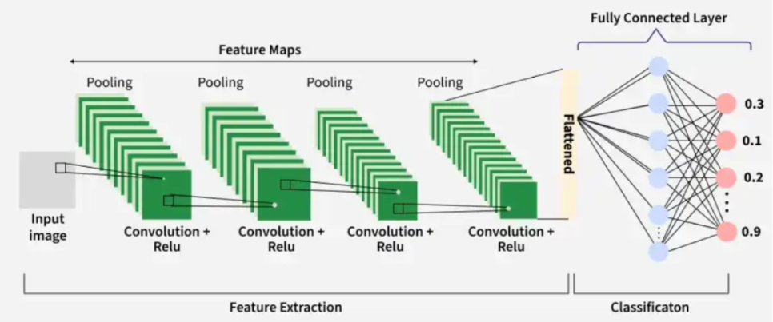
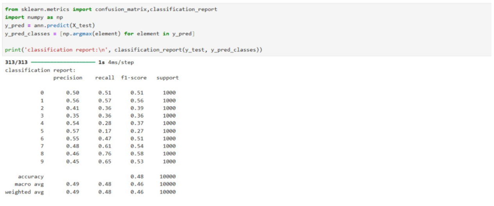
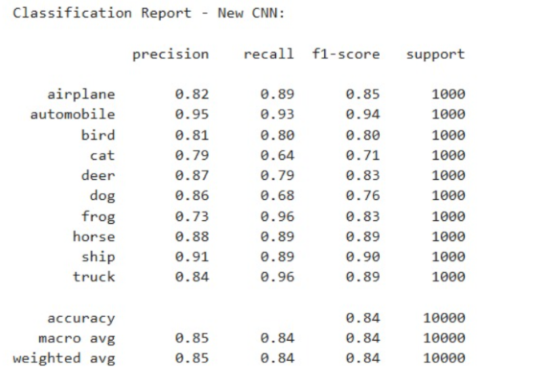
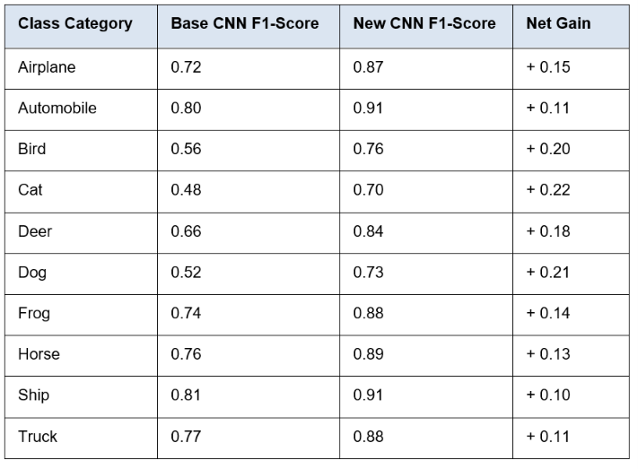

## 1. Project Summary
In this tutorial, the primary objective was to build, evaluate, and systematically improve deep learning models for image classification. The project utilized the CIFAR-10 dataset, which consists of 60,000 color images categorized into 10 different object classes. The models were developed in a Jupyter Notebook environment using Python, heavily leveraging the TensorFlow and Keras deep learning frameworks.

The project progressed through the evaluation of three distinct architectures:
1.  **Artificial Neural Network (ANN):** Served as a baseline but performed poorly (~48% accuracy) because it prematurely flattens image data, losing crucial spatial structure.
2.  **Base CNN:** Improved accuracy to ~70%. However, it suffered from a shallow architecture (only two convolutional blocks with 3x3 kernels), lacked Batch Normalization, and utilized no Dropout Regularization. As a result, it struggled with information bottlenecks and overfitting, particularly failing to differentiate visually similar classes like cats and dogs.
3.  **Enhanced CNN:** To overcome these weaknesses, I engineered a highly optimized CNN. This model featured a deeper architecture with progressive filter scaling (32 to 64 to 128 filters) to learn highly complex hierarchical features. I integrated Batch Normalization to stabilize training, applied strategic Dropout Regularization (up to 50% in the Dense layer) to prevent data memorization, and implemented Data Augmentation (flipping, shifting, zooming) to increase data variance. 

The resulting Enhanced CNN was a massive success, increasing overall test accuracy to ~85%, dropping test loss from 0.90 to 0.48, and shrinking the overfitting gap between training and validation accuracy to just 4%.

---

## 2. Tutorial Deliverables

**CNN Architecture & Feature Extraction:**

*Figure 1: Illustration of the Convolutional Neural Network architecture, showing feature extraction (Convolution + ReLU + Pooling) and final classification via Fully Connected Layers.*

**Classification Report (Base CNN vs Enhanced CNN):**

*Figure 2: The classification reports comparing the Base CNN (~70% accuracy) with the Enhanced CNN (~85% accuracy), highlighting massive improvements in F1-scores.*

**Per-Class Performance Improvements:**

*Figure 3: Breakdown of the F1-Scores. The deeper architecture allowed the new model to successfully distinguish between complex visual similarities, jumping from 0.48 to 0.70 for 'Cats' and 0.52 to 0.73 for 'Dogs'.*

---

## 3. Reflection

### What I Have Learnt

* I successfully navigated Python syntax errors, data formatting problems (such as incorrect use of the `.shape` function), and label formatting issues during data visualization. 
* By directly analyzing classification reports and confusion matrices, I learned how to identify model overfitting and iteratively solve it using hyperparameter adjustments like Dynamic Learning Rate Scheduling and Data Augmentation.
* Instead of training a model entirely from scratch, we could utilize highly advanced pre-trained models like ResNet or EfficientNet to achieve state-of-the-art accuracy with much better computational efficiency.