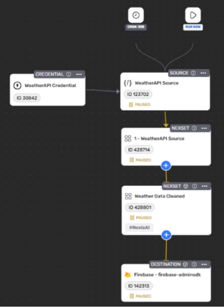
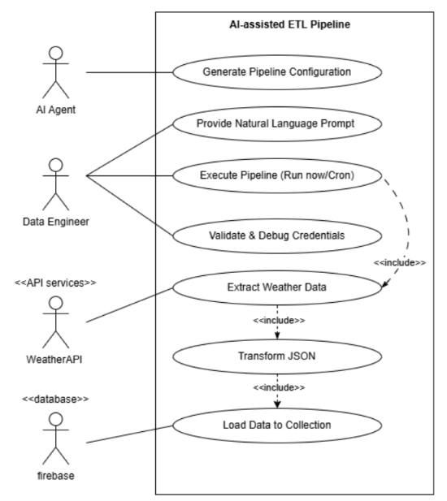
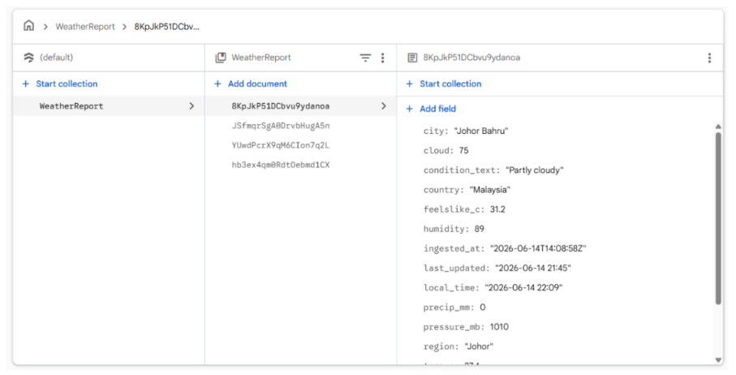

## 1. Project Summary
In this tutorial, I explored the integration of Generative AI in data engineering by building an automated ETL pipeline with the assistance of an AI agent. The core objective was to extract real-time weather data for Johor Bahru from WeatherAPI.com, transform the highly nested JSON response into a clean, flat structure, and load it into a document-based database (Firebase Firestore).

Instead of manually writing the code for each component from scratch, I utilized natural language prompts to guide the AI agent. The AI agent functioned as a pipeline construction assistant, helping to establish the API connection, discover available fields, generate the exact JSON flattening logic, and configure the Firebase destination. The final pipeline was scheduled to execute automatically every two minutes via a cron job, continuously inserting new weather documents into the `weatherReport` Firestore collection.

---

## 2. Tutorial Deliverables

**AI-Assisted Pipeline Architecture:**



*Figure 1: The visual pipeline flow connecting the WeatherAPI source, the AI-generated transformation step, and the Firebase destination.*

**Use Case Diagram:**



*Figure 2: Use case diagram illustrating the collaboration between the human Data Engineer (handling prompts and credential validation) and the AI Agent (generating configurations).*

**Data Transformation Logic:**

```json
{
  "country": "Malaysia",
  "city": "Johor Bahru",
  "region": "Johor",
  "local_time": "2026-06-13 13:38",
  "temp_c": 32.2,
  "condition_text": "Partly cloudy",
  "humidity": 71,
  "wind_kph": 6.8,
  "cloud": 75,
  "uv": 9.3,
  "ingested_at": "2026-06-13T05:38:31Z"
}
```

*Figure 3: A sample output document showing how the AI successfully flattened the nested WeatherAPI response into a clean NoSQL format.*


**Firebase Firestore Loading**



*Figure 4: Successful ingestion of the transformed weather data documents into the Firebase Firestore collection*

## 3. Reflection

### What I Have Learnt

* I learned that AI agents are incredibly efficient at handling repetitive boilerplate tasks, such as formulating API extraction logic and flattening nested JSON responses. Because I could simply state my requirements in a prompt, my development time was significantly reduced.
* The current extraction phase could be expanded to process multiple cities simultaneously to build a more comprehensive weather database.
* I would mandate the AI to include data quality validations, such as empty value processing, duplicate detection, and null checks before the data is ever loaded into Firebase.