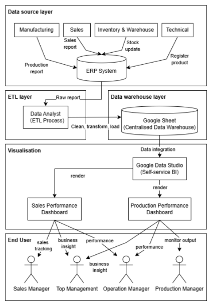
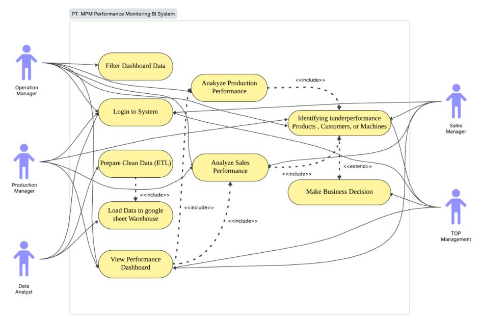
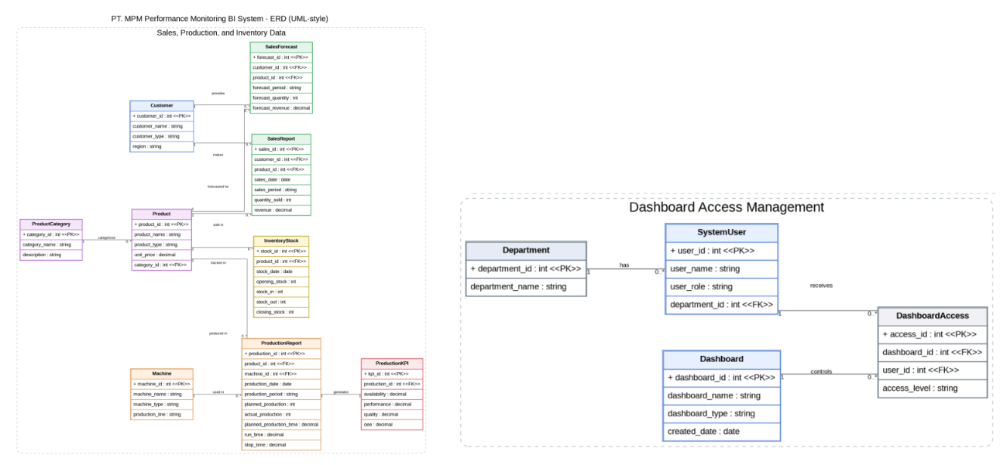
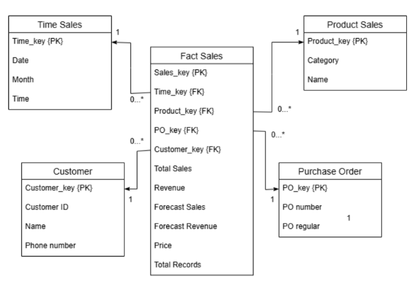
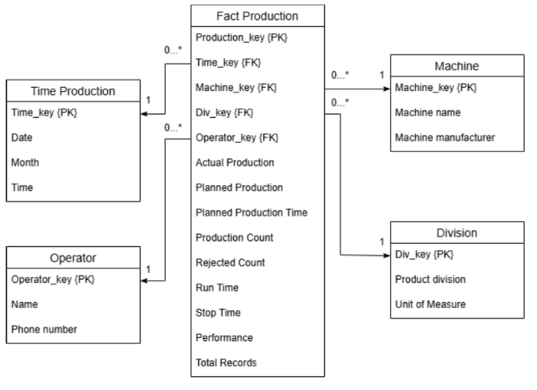

## 1. Project Summary
For this assignment, our group co-authored an academic tutorial article focusing on the conceptualisation and design of a Business Intelligence (BI) system for PT. MPM, a packaging manufacturing company. The core business problem was that PT. MPM lacked a proper system to monitor its performance, resulting in management struggling with a lack of visibility, untracked Key Performance Indicators (KPIs), and data being trapped in raw formats rather than yielding useful insights.

To resolve these issues, we designed a BI solution using the Waterfall approach. The proposed solution features a comprehensive five-layer system architecture:
1.   **Data Source Layer:** Extracts operational data from the company's ERP system across manufacturing, sales, inventory, and technical departments.
2.   **ETL Layer:** A Data Analyst manages automated pipelines to clean raw reports, remove irrelevant information, and convert data into structured formats.
3.   **Data Warehouse Layer:** The cleansed data is loaded into Google Sheets, which serves as the centralized, single source of truth.
4.   **Visualisation Layer:** Connects the data warehouse to Google Data Studio (a Self-service BI tool) to render interactive dashboards.
5.   **End User Access:** Delivers insights to specific stakeholders, such as Top Management, Production Managers, and Sales Managers.

We designed Entity Relationship Diagrams (ERDs) and multidimensional schemas to structure the data for two primary interfaces: 
1.  **Sales Performance Dashboard:** Tracks revenue streams, product trends, and target vs. reality forecasts.
2.  **Production Performance Dashboard:** Monitors Overall Equipment Effectiveness (OEE), operational ratios, and machine health.

---

## 2. Tutorial Deliverables

**System Architecture:**

*Figure 1: The five-layer architecture illustrating data flow from the ERP system, through the ETL process, and into Google Data Studio.*

**Use Case Diagram:**

*Figure 2: Use case diagram illustrating how different actors (Top Management, Production Manager, Data Analyst, Operations Manager, and Sales Manager) interact with the BI system.*

**Entity Relationship Diagram (ERD):**

*Figure 3: The UML-style ERD dividing the system into an access management module (controlling permissions) and an operational performance data module (storing sales, inventory, and machine data).*

**Multidimensional Schema Design:**

*Figure 4: The Fact Sales and Fact Production tables connected to their respective descriptive dimension tables (e.g., Time, Product, Customer, Machine) to allow in-depth filtering and analysis.*

---

## 3. Reflection

### What I Have Learnt

* By formulating specific User Stories, I learned how to directly translate business needs into technical requirements.
* The current architecture utilizes Google Sheets as the centralized data warehouse. While cost-effective, Google Sheets lacks the processing power and row limits required for true big data generated by a manufacturing ERP system. Migrating this layer to a scalable cloud data warehouse like Microsoft Azure Synapse would future-proof the architecture.
* Currently, the ETL layer relies on a Data Analyst managing automated pipelines. Introducing a dedicated orchestration tool like Azure Data Factory would provide better error handling, scheduling, and logging, reducing the dependency on manual oversight.